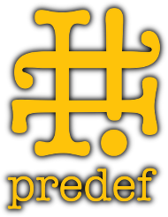

:sectanchors:
:nofooter:
:source-highlighter: pygments
:source-language: c++
:caution-caption: ⚑
:important-caption: ‼
:note-caption: ℹ
:tip-caption: ☀
:warning-caption: ⚠
:CPP: C++
:PP: ++

ifdef::backend-html5[]
++++

++++
endif::[]

[.menubar]
[.menubar-item]#<<Documentation>>#
[.menubar-item]#<<Download>>#
[.menubar-item]#link:https://github.com/grafikrobot/hash-predef[GitHub]#
[.menubar-item]#image:https://img.shields.io/badge/license-BSL%201.0-blue.svg["Boost Software License 1.0", link="LICENSE.txt"]#
[.menubar-item]#image:https://img.shields.io/azure-devops/build/grafikrobot/e8ee04a8-aec2-4947-aaac-382da1df562d/4/master.svg?label=master&logo=azuredevops["master build", link="https://dev.azure.com/grafikrobot/Hash%20Predef"]#
[.menubar-item]#image:https://img.shields.io/azure-devops/build/grafikrobot/e8ee04a8-aec2-4947-aaac-382da1df562d/4/develop.svg?label=develop&logo=azuredevops["develop build", link="https://dev.azure.com/grafikrobot/Hash%20Predef"]#

== Hash Predef
[.logo]

This library defines a set of compiler, architecture, operating system,
library, and other version numbers from the information it can gather of C,
{CPP}, Objective C, and Objective C++ predefined macros or those defined
in generally available headers. It provides utilities to define your own
set of such version macros and to consume existing ones.

== Overview

=== Features

[.feature]
[.icon]#▦#
*Detection of architectures*:
ARM,
Blackfin,
Convex Computer,
DEC Alpha,
HP/PA RISC,
Intel IA-64,
Intel Itanium 64,
Intel x86,
MIPS,
Motorola 68k,
PowerPC,
PTX,
Pyramid 9810,
RISC-V,
RS/6000,
SPARC,
SuperH,
System/370,
System/390,
z/Architecture.

[.feature]
[.icon]#⚙#
*Detection of compilers*:
Borland {CPP},
Clang,
Comeau {CPP},
Compaq C/{CPP},
Diab C/{CPP},
Digital Mars,
Dignus Systems/{CPP},
EDG {CPP} Frontend,
EKOpath,
GCC XML,
Gnu GCC C/{CPP},
Green Hills C/{CPP},
HP a{CPP},
IAR C/{CPP},
IBM XL C/{CPP},
Intel C/{CPP},
Kai {CPP},
LLVM,
MetaWare High C/{CPP},
Metrowerks CodeWarrior,
Microsoft Visual C/{CPP},
Microtec C/{CPP},
MPW {CPP},
NVCC,
Oracle Solaris Studio,
Palm C/{CPP},
Portland Group C/{CPP},
SGI MIPSpro,
TenDRA C/{CPP},
Watcom {CPP}.

[.feature]
[.icon]#§#
*Detection of language standards*:
CUDA C/{CPP},
Objective-C,
Standard {CPP},
Standard C.

[.feature]
[.icon]#⍟#
*Detection of libraries*:
{CPP} Standard,
CloudABI's standard C,
Comeau Computing Standard {CPP},
Dinkumware {CPP} Standard,
GNU glibc,
GNU libstdc{PP},
IBM VACPP Standard {CPP}
libc{PP} {CPP} Standard,
Metrowerks,
Modena Software Lib{PP},
Roguewave Standard {CPP},
SGI Standard {CPP},
STLport Standard {CPP},
uClibc,
VMS libc,
z/OS libc.

[.feature]
[.icon]#❖#
*Detection of operating systems*:
AmigaOS,
Android,
BeOS,
BSD,
BSDi BSD/OS,
Cygwin,
DragonFly BSD,
FreeBSD,
Haiku,
HP-UX,
IBM AIX,
IBM OS/400,
iOS,
IRIX,
Linux,
macOS,
Microsoft Windows,
NetBSD,
OpenBSD,
QNX NTO,
Solaris,
Unix Environment,
VMS.

[.feature]
[.icon]#⧋#
*Detection of platforms*:
Android,
CloudABI,
iOS Device,
iOS Simulator,
MinGW-w64,
MinGW,
UWP Desktop,
UWP Phone,
UWP Runtime,
UWP Server,
UWP Store,
UWP System.

[.feature]
[.icon]#⇶#
*Detection of hardware*:
SIMD ARM,
SIMD PPC,
SIMD x86 AMD,
SIMD x86.

[.feature]
[.icon]#⇄#
*Detection of endianess*:
Byte-Swapped Big-Endian,
Byte-Swapped Little-Endian,
Word-Swapped Big-Endian,
Word-Swapped Little-Endian.

[.feature]
[.icon]#ↂ#
Consistent and normalized version number definitions.

[.feature]
[.icon]#∞#
Version numbers that are always defined so that one doesn't have to guard
with `#ifdef`.

[.feature]
[.icon]#≫#
Guard macros that can be used for `#ifdef` checks.

[.feature]
[.icon]#∑#
All possible definitions are included with the single `#include <predef.h>`
so that it's friendly to pre-compiled header usage.

[.feature]
[.icon]#∈#
Specific definitions can be included, ex. `#include <predef/os/windows.h>`
for single checks.

[.feature]
[.icon]#◍#
The headers are usable from multiple languages, that support the C preprocessor.
In particular {CPP}, C, Objective C, and Objective {CPP}.

[.feature]
[.icon]#☉#
Workaround checking macros to facilitate writing portable code variations.

=== Quick Start

As Hash Predef is a header only library, using it is as easy as downloading it
and adding the header directory to your project include paths. Doing this is,
of course, project dependent:

* If you are using link:https://boostorg.github.io/build/[B2] you can use it
  directly by adding a `use-project /hash-predef : /path/to/hash-predef/root`
  declaration and adding `<dependency>/hash-predef` to your targets (or
  projects).
* If you are using Cmake you can `add_subdirectory(<path-to-hash-predef-root>)`
  and then refer to the `Hash::predef` target to define the dependency.
* For others you can directly add the `hash-predef-root/include` directory to
  your include paths.

After that ou can directly use the main header to introspect your compiles.
For example to check which version of GCC you re building with:

[source]
----
#include <predef.h>
#include <iostream>

int main()
{
  if (HASH_PREDEF_COMP_GNUC >= HASH_PREDEF_VERSION_NUMBER(4,0,0))
    std::cout
      << "GCC compiler is at least version 4.0.0\n";
  else
    std::cout
      << "GCC compiler is at older than version 4.0.0, or not a GCC compiler\n";
  return 0;
}
----

If you prefer using preprocessor guards you can do that just as easily:

[source]
----
#include <predef/compiler/gcc.h>
#include <iostream>

int main()
{
  #if (HASH_PREDEF_COMP_GNUC >= HASH_PREDEF_VERSION_NUMBER(4,0,0))
  std::cout
    << "GCC compiler is at least version 4.0.0\n";
  #else
  std::cout
    << "GCC compiler is at older than version 4.0.0, or not a GCC compiler\n";
  #endif
  return 0;
}
----

You can get more details on how to use other features, like workaround macros,
in the documentation.

== Documentation

In addition to the full documentation included in the release archives the
documentation for the latest release is available
link:manual/master/index.html[online]. You can also read the documentation for
the next release in the
link:manual/develop/index.html[develop branch]. The documentation contains a
full reference to every definition and details on how to use features,
like workaround macros, endian macros, etc.

== Download

Current, and past, releases are available in
link:https://github.com/grafikrobot/hash-predef/releases[GitHub].

== About

This is a "completely standalone" version of the Boost Predef library.
It contains at least the same functionality as the Boost version. They
are both kept approximately in sync with the help of a "clever" bidirectional
conversion script. It was created to reduce the perceived burden of using
the library for users that can't normally consume Boost C++ Libraries.

[[copyright]]
Copyright Rene Rivera 2019
-- Distributed under the Boost Software License, Version 1.0.
(See link:LICENSE.txt[LICENSE.txt])
